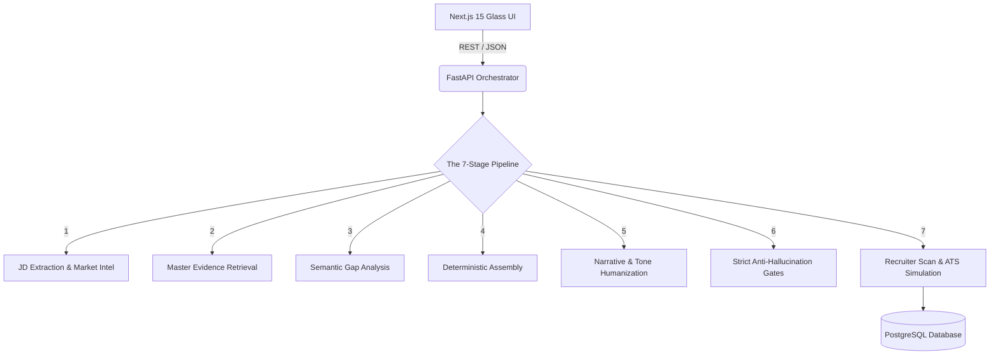

<div align="center">

# 🚀 ResumePilot
### *The Recruiter-Grade AI Employability Operating System*

<p align="center">
  <em>Upload your master resume once. Let our 75+ specialized AI engines optimize your career trajectory, tailor your narrative, and bypass the ATS—deterministically and authentically.</em>
</p>

[](https://nextjs.org/)
[](https://fastapi.tiangolo.com/)
[](https://www.postgresql.org/)
[](https://x.ai/)

---

</div>

## 🌌 The V4 Evolution

ResumePilot is **not** a generic AI text generator. We believe in optimizing *REAL evidence*—never hallucinated expertise. 

ResumePilot acts as your **personal career intelligence platform**. It strictly preserves your authenticity, rejects validation failures, and systematically removes robotic "AI buzzwords" to ensure you sound like a highly competent, human engineer.

### ✨ Core Capabilities

| Capability | Description |
| :--- | :--- |
| 🧠 **Account-Based Evidence Graph** | Upload your master resume once. The system extracts your career into a rich, deterministic JSON profile. All tailoring pulls strictly from this single source of truth. |
| 🎯 **Recruiter-Grade Tailoring** | Paste a JD. ResumePilot maps your *real* evidence to the role, rewrites bullets for maximum impact, and reorders projects based on technical depth and relevance. |
| 🎙️ **Interview Simulator** | Generates role-calibrated technical, behavioral, and system design questions based strictly on your master profile evidence and the targeted company. |
| 📊 **Career Intelligence** | Real-time market demand graphs, career progression maps, role transition history, and skill gap analysis (You vs. Market). |
| 🌐 **Personal Branding Engine** | Auto-generates optimized LinkedIn headlines, GitHub readmes, Portfolio copy, and Twitter strategies using your authentic experience. |

---

## 🏗️ The 75+ Engine Architecture

ResumePilot is powered by a massively parallel orchestration pipeline comprising over **75 specialized micro-engines**.



### 🧬 Phase 5: The Narrative Intelligence Subsystem
In V4, we introduced the **Recruiter-Grade Narrative & Humanization System**. This subsystem ensures your resume never feels "AI-generated":
- **Candidate Voice Engine:** Preserves authentic student/junior tone.
- **Experience Calibration Engine:** Prevents exaggerated "enterprise-scale" claims.
- **Story Flow Engine:** Optimizes how recruiters mentally process your resume (Who -> What -> How -> Why).
- **Humanization Engine:** Strips out overly robotic phrasing (e.g., changing *"orchestrated distributed paradigms"* to *"built scalable systems"*).

---

## 🚀 Quick Start

### Prerequisites
- **Node.js** 20+ and npm
- **Python** 3.12+
- **PostgreSQL** 16+
- **Grok API Key** from [xAI Console](https://console.x.ai/)

### 🛠️ Backend Setup (FastAPI)
```bash
cd backend
python -m venv venv
venv\Scripts\activate    # Windows
# source venv/bin/activate  # macOS/Linux

pip install -r requirements.txt
python -m spacy download en_core_web_sm

cp .env.example .env     # Add your DB URL & xAI API Key
uvicorn app.main:app --reload --port 8000
```

### 💻 Frontend Setup (Next.js)
```bash
cd frontend
npm install

# Edit .env.local: NEXT_PUBLIC_API_URL=http://localhost:8000/api/v1
npm run dev
```
Navigate to `http://localhost:3000` to access the Employability Dashboard.

---

## 🛡️ Zero-Hallucination Guarantee

ResumePilot implements ruthless safeguards:
1. **No Invented Technologies:** If a technology isn't in your Master Profile, it will never appear on the tailored resume.
2. **No Fabricated Projects:** The system re-weighs existing projects based on JD relevance but never invents new ones.
3. **Metric Realism:** Enforces authentic internship/junior-level phrasing and strips out 100x exaggerated claims.

---

## 📜 License

MIT License — see [LICENSE](LICENSE) for details.

<div align="center">
  <br>
  <b>Built with ❤️ using FastAPI, Next.js, and Grok AI</b>
</div>
